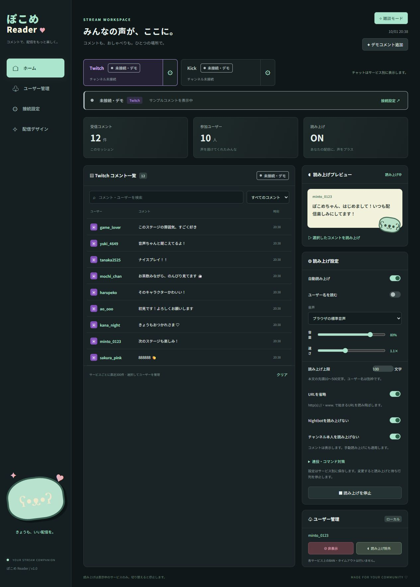
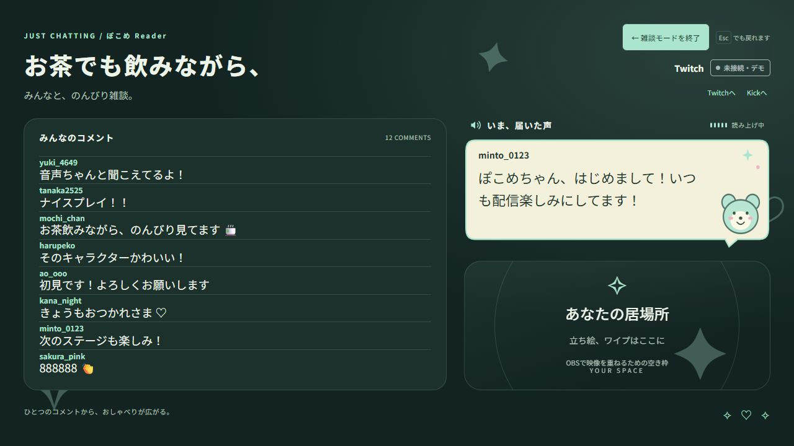

# ぽこめ Reader

Twitch・Kickのコメント表示・音声読み上げ・ローカルのユーザー管理アプリ。

## 動作画面

サンプルコメントを使って、ローカル開発版で読み上げ中の画面を撮影しています。GitHub Pages版ではKickのボタン・接続設定は表示されません。

### 通常画面

コメント一覧、読み上げプレビュー、読み上げ設定、ユーザー管理をまとめて操作できます。



### 雑談モード

設定を隠し、コメント、読み上げ中の内容、立ち絵・ワイプ用のスペースを表示します。画像はコメント8件・標準背景画像の設定例です。



## GitHub Pages版（github.io）について

[公開ページを開く](https://devunit47.github.io/pkm-comment-reader/)

**GitHub Pagesの公開ページではTwitchのみ利用できます。このページではKickに接続できません。**

Kickへの接続は、今後公開予定のローカル版で対応予定です。現時点では、このリポジトリの開発版をPC上で起動するとTwitch・Kickの両方を利用できます。ローカル版の公開時期は未定です。

## ローカルで動かす（Twitch・Kick／開発版）

1. Node.js 20以上を用意します。
2. このリポジトリをダウンロードして展開するか、Gitでクローンします。
3. `package.json`があるフォルダーでターミナルを開き、次のコマンドを実行します。外部パッケージのインストールは不要です。

   ```sh
   npm start
   ```

4. ブラウザで [http://localhost:5173](http://localhost:5173) を開きます。
5. 上部のTwitchボタン右側の歯車から接続設定を開き、Twitchのチャンネル名を入力して接続します。
6. Kickを使う場合は、Kickボタン右側の歯車から接続設定を開き、Kickのチャンネル名を入力して接続します。

Twitch・Kickは同時に接続できますが、チャットは統合しません。上部のボタンで表示を切り替え、表示中のサービスだけを読み上げます。接続に成功したチャンネル名はサービス別に保存され、次回の入力欄に復元されます。次回も接続操作は必要です。

利用中はターミナルを開いたままにしてください。終了するときはターミナルで`Ctrl+C`を押します。Kickの接続にはこのローカルサーバーが必要なので、`index.html`を直接開く方法では利用できません。

## 開発版とGitHub Pages版

同じリポジトリで開発を続けられます。画面・読み上げ・デザインのコードは共用し、公開用ビルドだけで利用可能なサービスを切り替えます。

| 用途 | コマンド | 利用できるサービス |
| --- | --- | --- |
| ローカル開発 | `npm start` | Twitch・Kick（別々のチャット） |
| 公開ファイル生成 | `npm run build:pages` | `dist/`にTwitch専用版を生成 |
| 公開版の動作確認 | ビルド後に`npm run preview:pages` | http://localhost:5174/preview/ |

公開版にはKickのボタン・接続設定を表示せず、Kickの接続を作成しません。Kick用モジュール`kick.js`（公開Pusherキーを含む）、ローカルサーバー、テスト、開発用ファイルは公開用ファイルに含めません。共通の接続管理コードは共用します。相対パスを使うため、`https://ユーザー名.github.io/リポジトリ名/`形式でも動作します。`dist/`は生成物なのでGitには登録しません。出力先に想定外のファイルがある場合は、誤公開を防ぐためビルドを停止します。

リポジトリをGitHubへ登録したあと、Settings → Pages → Build and deployment → Sourceを「GitHub Actions」に設定します。Actionsの「Publish Twitch version to GitHub Pages」を選び、「Run workflow」で公開するブランチを指定して実行します。検証に成功した場合だけ`dist/`を公開します。ワークフローは手動実行のみで、開発中のpushだけでは公開版を更新しません。[GitHub公式の公開設定手順](https://docs.github.com/en/pages/getting-started-with-github-pages/configuring-a-publishing-source-for-your-github-pages-site)

Twitchはブラウザから直接WebSocketへ接続するため、この公開版にNode.jsサーバーや認証秘密鍵は不要です。ブラウザの音声・保存機能は公開版でも使います。localhostと公開URLの保存データは別で、設定や立ち絵は自動移行しません。同じGitHub Pagesのオリジン上の別アプリとはlocalStorageのキーが共有されるため、このアプリの複数公開版では設定が共有されることがあります。音声はブラウザ・OSと操作による再生制限に依存します。

## 更新情報

アプリのメニューにある「更新情報」で、使い方に関わる変更を確認できます。

## 使い方

目的に合わせて、次の項目を参照してください。GitHub Pages版ではTwitchのみ利用できます。

- [接続とサービスの切り替え](#接続とサービスの切り替え)
- [音声の読み上げ](#音声の読み上げ)
- [コメントとユーザーの管理](#コメントとユーザーの管理)
- [雑談モードとOBSへの取り込み](#雑談モードとobsへの取り込み)
- [画面の配置とデザイン](#画面の配置とデザイン)
- [読み上げ枠の表示とスタイル](#読み上げ枠の表示とスタイル)
- [接続方式と利用上の制約](#接続方式と利用上の制約)

### 接続とサービスの切り替え

- 「接続設定」の専用入力欄で、Twitch・Kickそれぞれのチャンネルに接続します。同時接続でき、片方の切断・再接続はもう片方に影響しません。

- 上部には各サービスの接続状態とチャンネル名を表示します。接続済み（緑）、接続準備中（黄）、未接続・デモ（灰）、エラー・切断（赤）を文字と色で区別します。右端の歯車から、そのサービスの接続設定とチャンネル入力欄へ移動できます。

- **前回接続したチャンネル名は、接続成功時にサービス別にブラウザへ保存します。** 次回起動・再読み込みで各入力欄に復元します。未接続の入力や接続失敗で前回の値を上書きしません。切断しても保存値は残ります。自動接続・自動再接続は行いません。

- 上部のTwitch・Kickボタンで表示するサービスを切り替えます。統合チャットはなく、コメント履歴・受信数・初コメント判定・検索・ユーザー設定はサービスごとに独立しています。

- 初期表示は各サービスのサンプルコメントです。「デモコメント追加」で表示中のサービスにだけ追加できます。接続開始時にそのサービスのサンプルと旧履歴を消去します。

### 音声の読み上げ

- コメントを選択して個別に読み上げたり、自動読み上げを有効にできます。読み上げ設定はサービスごとに保持し、自動読み上げは表示中のサービスだけが対象です。サービス切り替え時に再生と待ち行列を停止し、非表示サービスのコメントを後から読み上げることもありません。日本語音声はOS・ブラウザに依存します。読み上げ待ちは最大20件です。

- 自動読み上げは初期状態でONです。ON／OFFをTwitch・Kick別に保存し、次回起動時に復元します。起動時に並ぶサンプルコメントは読み上げません。

- ボイスはホームの「読み上げ設定」でOS・ブラウザに用意された日本語音声から選択します。Twitch・Kick別に保存します。選択した音声が環境にない場合は標準音声で読み上げます。配信に映す場合はOBSでアプリの画面と音声を取り込んでください。

- 読み上げ本文は初期値100文字、10〜500文字で設定できます。ユーザー名は別枠です。URL省略は初期状態で有効で、`http://`・`https://`・`www.`から始まるURLを取り除きます。URLだけのコメントは読み上げません。元のコメント表示は変更せず、プレビューには読み上げ用の本文を表示します。

- 「連投・コマンド対策」では同じユーザーの同じ読み上げ本文を30秒間省略（初期状態で有効）、`!`・`/`から始まるコマンドの省略（初期状態で無効）、ユーザーごとの読み上げ間隔（0〜60秒、初期値0で無効）を設定できます。同文省略と間隔制限は自動読み上げだけに適用し、手動の読み直しは制限しません。

- Nightbotと接続先チャンネル本人を読み上げない設定をそれぞれ用意しています（初期状態で有効）。表示名ではなくアカウント名で判定し、コメント一覧には表示します。自動・手動の両方の読み上げに適用します。

- 文字数・URL・連投・コマンド・ユーザー除外設定はTwitchとKick別にブラウザへ保存します。変更すると現在の読み上げと待ち行列を停止します。読み上げ方式はブラウザ標準・VOICEVOX・COEIROINK v2から選べます（追加方式はローカル版のみ）。

#### VOICEVOX・COEIROINKの声を使う（ローカル版）

1. [VOICEVOX](https://voicevox.hiroshiba.jp/)または[COEIROINK v2](https://coeiroink.com/)を公式サイトから入手して、同じPCで起動します。本体・音声モデルはこのアプリに同梱しません。
2. ホームの「読み上げ設定」→「読み上げ方式」で音声ソフトを選びます。
3. 取得された「音声」から話者・スタイルを選び、「音声テスト」で確認します。起動後や声を追加した後は「声を再取得」を押してください。

VOICEVOXは標準ポート50021、COEIROINK v2は50032へローカルサーバー経由で接続します。独自のポート設定・COEIROINK v1には対応しません。音量・速さ、読み上げ除外・待ち行列・停止はブラウザ標準音声と共通です。方式と選択した声はTwitch・Kick別に保存します。音声ソフト未起動・生成失敗時はエラーを表示し、別の声へ自動切り替えしません。GitHub Pages版はブラウザ標準音声のみです。

配信ではクレジット表記と、選択した各音声の利用条件に従ってください。[VOICEVOXの利用規約](https://voicevox.hiroshiba.jp/term/)・[COEIROINKの利用規約](https://coeiroink.com/terms)

### コメントとユーザーの管理

- 「配信デザイン」でリストに保持するコメント数を1〜300件に設定できます（初期値300件）。上限を超えると古いコメントを削除します。画面の表示件数は固定せず、枠と文字サイズに応じて変わります。雑談画面のコメント欄にある＋／−で16〜28pxの文字サイズを調整・保存できます。枠に収まらないコメントはスクロールして確認できます。

- コメントはサービスごとに直近300件をメモリに保持し、ページを閉じると消えます。初コメントはそのサービスへの接続セッションでの初登場です。

- ユーザー名・コメントをクリックすると、ユーザーを非表示・このコメントを非表示・読み上げ除外のメニューが開きます。コメントの非表示はその1件だけに適用されます。設定はサービス別にこのブラウザに保存され、「ユーザー管理」で解除できます。同じユーザー名でも他サービスには影響しません。旧バージョンのユーザー設定はTwitchだけに引き継ぎます。各サービス上のBAN・タイムアウトとは別です。

### 雑談モードとOBSへの取り込み

- 「雑談モード」で配信に映す画面へ切り替えます。設定・ユーザー管理・検索などを隠し、チャット、実際に読み上げ中のコメント、装飾、配信者用スペースを表示します。Twitch・Kickのコメントは混在せず、表示中のサービスのみ読み上げます。右上に常時表示する「雑談モードを終了」で操作画面に戻れます。Escapeキーでも戻れます。

- 配信者用スペースにOBSで顔映像・Vtuberモデルを重ねて配置できます。アプリにはカメラ起動・取得機能はありません。立ち絵画像を表示することもできます。

- 雑談画面で文章にマウスを重ねると鉛筆ボタンが表示されます。タイトル（60文字）、ひとこと・画面下の文章（100文字）、読み上げ枠の見出し（40文字）をその場で編集し、「保存」で反映します。空欄でも鉛筆ボタンから再編集できます。

### 画面の配置とデザイン

- 「配信デザイン」で4つのテーマ、アクセント色、文字サイズ、装飾の有無を変更できます。デザインと立ち絵画像はこのブラウザに保存します。画像はPNG・JPEG・WebP・GIFの2MB以下に対応します。

- 「配信デザイン」の「画面の配置」から、ホーム・雑談画面の枠を移動・サイズ変更・非表示にできます。配置は画面ごとに保存します。同じ設定画面で見た目を読み込み・保存して共有できます。CSSを直接編集する機能は「詳しく見た目を編集する（CSS）」にあります。[カスタマイズ仕様](docs/customization.md)を参照してください。

### 読み上げ枠の表示とスタイル

- 「いま、届いた声」は読み上げ終了後も5秒間残します。次の読み上げが始まると新しいコメントに切り替わり、停止・サービス切り替え時は表示をクリアします。

- 読み上げ枠は内容によらず一定の高さを確保します。複数行の本文でもコメント一覧の枠と文字サイズは変わりません。長い読み上げ本文は枠内でスクロールできます。

- 読み上げ枠は立ち絵・OBSスペースの上に配置し、チャットは隣の列の高さ全体を使います。枠の位置や大きさは「画面の配置」で自由に変更できます。読み上げ枠の見出し（40文字まで）は雑談画面の鉛筆ボタンで変更・保存できます。本文の文字サイズ（16・22・28・32px）は「配信デザイン」で変更できます。

- 読み上げ枠の見出しにスピーカーアイコンを表示し、読み上げ中は装飾用の波形が動きます（音量・音声波形とは同期しません）。状態は「読み上げ中／待機中」で表示します。終了後の本文保持中は待機中になり、波形が停止します。OSの動きを減らす設定ではアニメーションを停止します。

- 「読み上げ枠のスタイル」で「セリフの吹き出し」を選ぶと、立ち絵・ワイプ枠へ向くしっぽ付きの背景になります。背景色を変更・保存でき、本文の白黒は背景の明るさに合わせて切り替わります。通常のパネルにも戻せます。

- 「背景画像」は名前・コメント本文だけに画像を敷き、見出し・波形・状態表示は画像の外に表示します。標準の吹き出し画像を同梱し、新規設定の初期スタイルに使用します。PNG・JPEG・WebP・GIFの2MB以下の画像に差し替え、本文の文字色も変更できます。画像はこのブラウザに保存し、外部へアップロードしません。「標準の背景画像に戻す」で復元できます。既存のパネル・吹き出し設定は維持します。

### 接続方式と利用上の制約

接続は外部通信が必要です。認証、コメント送信、各サービス上でのモデレーションは未実装です。Webフォントが使えない場合はシステムフォントで表示します。

Kickは公開チャット用Pusher WebSocketを読み取り専用で購読します。チャンネル名からチャットルームIDを取得するため、localhostサーバーがKickのチャンネル情報APIへ問い合わせます。公開WebSocketは公式Webhook APIとは別の接続方式で、Kick側の仕様変更やアクセス制限で利用できなくなることがあります。公式Webhook APIの利用にはアプリ登録・認証・外部から到達可能な受信サーバーが必要なため、今回は導入していません。取得・購読・通信の失敗は画面に表示します。

接続方式の参考: [TwitchのWebSocket接続に関する告知](https://discuss.dev.twitch.com/t/decommission-of-non-secure-websocket-connections-to-twitch-irc-servers/64142)、[匿名接続に関する開発者フォーラム](https://discuss.dev.twitch.com/t/can-i-use-wss-irc-ws-chat-twitch-tv-with-justifan/63732)。匿名接続はサービス側の変更で使えなくなる可能性があります。

Kick接続の参考: [Pusherプロトコル](https://pusher.com/docs/channels/library_auth_reference/pusher-websockets-protocol/)、[公開チャット接続の実装例](https://gist.github.com/Linch1/861902c8a85977b4dbcb562966b65bed)、[Kick公式Webhook仕様](https://github.com/KickEngineering/KickDevDocs/blob/main/events/event-types.md)。2026年10月1日に公開WebSocketの購読成功とサービス別接続先の復元を実通信で確認しています。

## 確認

`npm run check` でJavaScript構文を、`npm test` でサービス分離・接続管理・保存値の復元・Kickチャンネル情報取得の回帰テストを実行できます。自動テストは外部サービスに接続しません。

## ライセンス・利用上の案内

**コメントやユーザー名を配信画面に表示したり、コメントを読み上げたりする場合は、Twitch・Kickなど、コメント取得元および配信先の各プラットフォームの利用規約・ガイドラインに従ってください。**

本プロジェクトは[MITライセンス](LICENSE)で公開しています。改変・再配布・商用利用が可能です。配布時は著作権表示とライセンス文を保持してください。正式な条件はLICENSEを参照してください。

- [免責事項・利用上の注意](DISCLAIMER.md)
- [保存データ・外部通信について](PRIVACY.md)
- [不具合報告・貢献の案内](CONTRIBUTING.md)
- [セキュリティ上の問題の報告](SECURITY.md)

外部サービス、OS・ブラウザの音声、第三者が提供する画像などには、それぞれの利用条件が適用されます。Google Fontsから取得するNoto Sans JPのライセンスは[公式配布元のOFL.txt](https://github.com/google/fonts/blob/main/ofl/notosansjp/OFL.txt)を参照してください。

## はじめての設定とバックアップ

メインメニューの「はじめての設定」から、接続・音声選択・音声テストの手順を確認できます。初回はホームにも案内を表示します。「案内を完了」で初回の表示を閉じられます。

「接続設定」の「設定のバックアップ」で接続先・音声・ユーザー設定・見た目・画像を一括保存できます。復元はファイル選択後に「復元する」を押すと適用され、画面を再読み込みします。コメント履歴と音声ソフト本体は含みません。バックアップにはユーザー名や画像が含まれるので、共有する前に内容を確認してください。

## Windowsのローカル配布版

開発者がWindows上で `npm run build:local` を実行すると、Node.js同梱の `dist-local/` が生成されます。フォルダー全体を配布し、利用者は展開後に `Start.cmd` をダブルクリックします。Node.jsのインストールやコマンド入力は不要です。VOICEVOX・COEIROINKは別途起動してください。

ブラウザを閉じてもサーバーはバックグラウンドで動作し、PCを終了すると停止します。開発用は5173、配布版は5174を使うため同時に起動できます。起動時にポート5174を確認し、このアプリが起動済みならブラウザだけを開きます。配布物にはNode.jsのライセンスを同梱します。Windowsの警告表示や組織の実行制限には別途対応が必要です。

開発サーバーのポートを変更する場合は、PowerShellで `$env:PORT = "5175"` を設定してから `npm start` を実行します。ポートごとにブラウザの保存設定は独立します。
